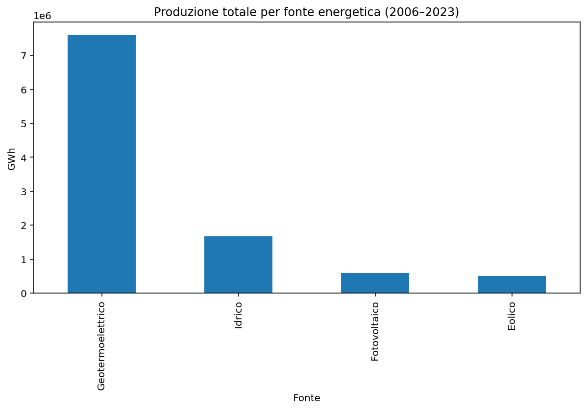
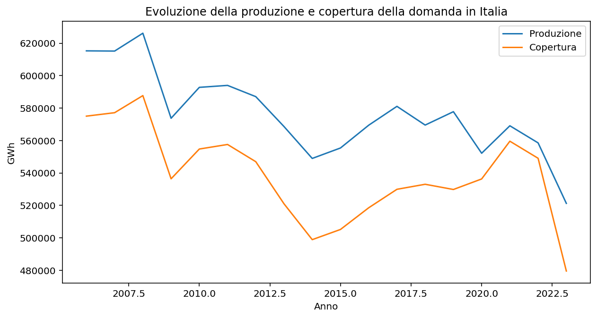

# Energy Production and Coverage Report (2006-2023)
## Overview
This report analyzes the total electricity production by energy source and the percentage contribution of each source to the annual demand in Italy from 2006 to 2023. Additionally, it examines the evolution of production and coverage of electricity demand over the same period.

## Total Production by Energy Source (2006-2023)

- Geotermoelettrico: Dominates with approximately 7 million GWh, indicating a significant reliance on geothermal energy.
- Idrico: Contributes around 2 million GWh, showing a moderate role in the energy mix.
- Fotovoltaico: Produces about 1 million GWh, reflecting growing solar energy adoption.
- Eolico: Contributes approximately 0.5 million GWh, indicating a smaller but increasing presence of wind energy.

## Percentage Contribution by Energy Source (2006-2023)

- The overall percentage of each energy source's contribution to demand has fluctuated over the years.
- Geotermoelettrico remains the leading contributor, peaking above 70% in the early years (2006-2008) and stabilizing around 50-60% in recent years.
- Idrico shows a gradual increase, reaching a peak of around 20% around 2013-2014, then stabilizing.
- Fotovoltaico and Eolico have seen modest growth, with contributions rising from near 0% to around 10% by 2023, indicating a diversification trend.

## Evolution of Production and Coverage (2006-2023)

- Production peaked around 2007-2008 at approximately 620,000 GWh, followed by a decline and stabilization around 560,000-580,000 GWh until 2020, with a noticeable drop to below 500,000 GWh by 2022.5.
- Coverage shows a similar trend, peaking around 580,000 GWh in 2007-2008, declining to a low of 500,000 GWh around 2015, and then recovering slightly before dropping to 480,000 GWh by 2022.5.
- The gap between production and coverage suggests periods of import/export imbalance, with coverage generally lagging behind production, indicating potential energy import needs.

## Conclusions

- Geothermal energy (Geotermoelettrico) remains the backbone of Italy's electricity production, though its dominance has slightly decreased over time.
- Renewable sources like Fotovoltaico and Eolico are gaining traction, contributing to a more diversified energy mix.
- The decline in both production and coverage since 2020 highlights potential challenges in meeting demand, possibly due to economic or infrastructural factors.

### Recommendations

- Further investment in renewable energy sources (Fotovoltaico, Eolico) could enhance energy security and reduce reliance on geothermal sources.
- Detailed analysis of the production-coverage gap could inform strategies to optimize energy imports and exports.
